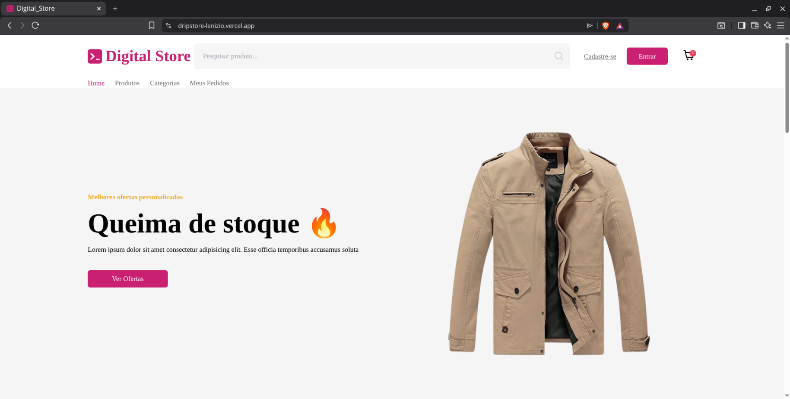

# 🛒 Digital Store - Fake Store Project

Este repositório é destinado a projetos de cursos, iniciativas pessoais e ideias em desenvolvimento, além de servir como espaço para aprender e dominar novas tecnologias.
Cada projeto terá o seu próprio README com informações detalhadas.
Os links para acessar cada projeto estarão disponíveis logo abaixo.
Agradeço desde já o interesse em acompanhar meus projetos e minha evolução.

Uma plataforma de e-commerce moderna e responsiva construída para simular a experiência real de uma loja digital. O projeto consome uma API de produtos e oferece funcionalidades avançadas de filtragem e navegação.

## 🚀 Funcionalidades
- **Listagem Dinâmica:** Renderização de produtos a partir de uma API externa.
- **Sistema de Filtros:** Filtragem inteligente por categorias utilizando botões do tipo `Radio`.
- **Design Responsivo:** Interface adaptável para dispositivos móveis e desktop.
- **UX Otimizada:** Loadings de transição e gerenciamento de estado eficiente com React Hooks.

## 🛠️ Tecnologias Utilizadas
- **React.js**: Biblioteca principal para construção da interface.
- **Tailwind CSS**: Framework utilitário para estilização rápida e moderna.
- **Lucide React / PrimeIcons**: Conjunto de ícones para melhor auxílio visual.
- **Vite**: Ferramenta de build para um desenvolvimento ágil.

## 📦 Veja o Projeto
[Acesse o site clicando aqui](https://dripstore-eshmsd36m-lenizio.vercel.app/)
